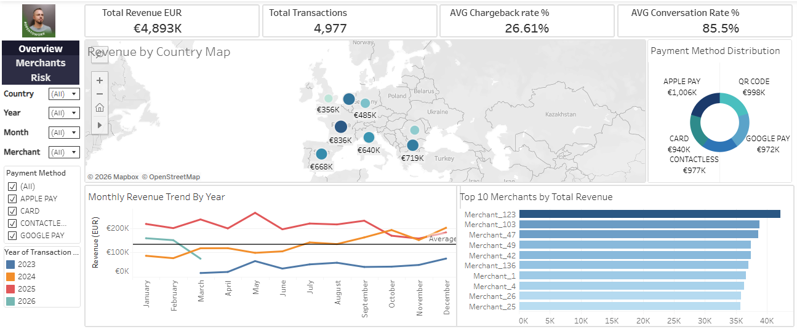
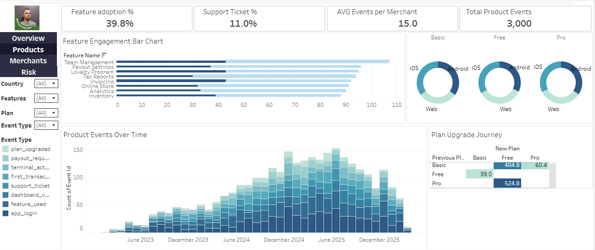
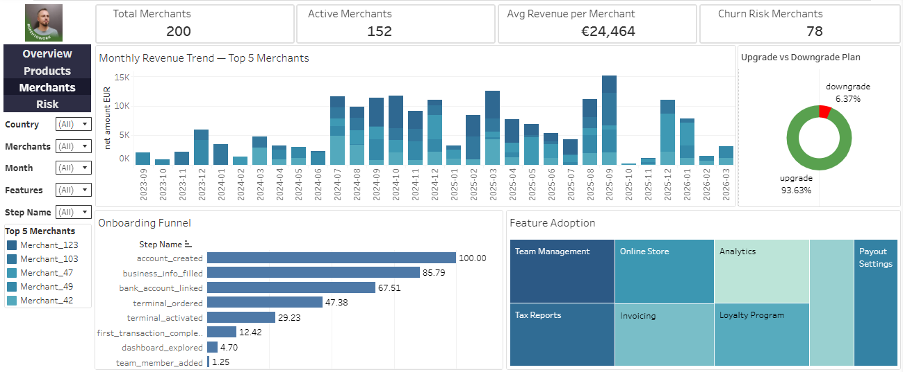
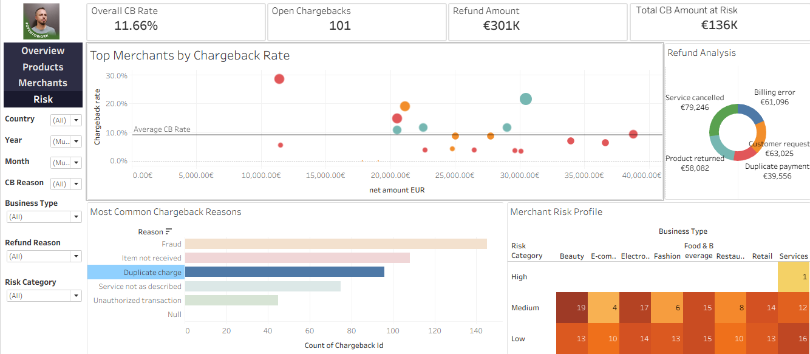

# 💳 Payments Analytics
> End-to-end payments analytics project built on simulated merchant data — covering revenue performance, merchant growth, risk & fraud analysis, and product engagement.

  

---

## 📌 Project Overview

This project simulates a real-world **Senior Product Data Analyst** workflow at global payments platform. The goal is to answer key business questions around merchant revenue, onboarding conversion, subscription plan changes, chargeback risk, and fraud patterns using **SQL** for data preparation and **Tableau** for visual analytics.

All data is **synthetically generated** and does not represent any real individuals or companies.

---

## 📊 Tableau Dashboards

### Dashboard 1: Overview
Answers the question: *"How is the business performing across all markets and payment methods?"*



**Sheets included:**
- 🗺️ **Revenue by Country Map** — map chart showing net revenue per market
- 📈 **Monthly Revenue Trend By Year** — multi-line chart with average reference line (2023–2026)
- 📊 **Top 5 Merchants by Total Revenue** — horizontal bar chart
- 🍩 **Payment Method Distribution** — donut chart by payment method volume

**KPI Cards:**
| KPI | Value |
|---|---|
| Revenue EUR | €4,893K |
| Total Transactions | 4,977 |
| AVG Chargeback Rate | 26.61% |
| AVG Conversion Rate | 85.5% |

---

### Dashboard 2: Products
Answers the question: *"How are merchants engaging with the product and which features drive the most value?"*



**Sheets included:**
- 📊 **Feature Adoption by Status** — horizontal bar chart showing active vs inactive merchants per feature, sized by total usage count
- 🍩 **Platform by Plan** — three donut charts (Basic / Free / Pro) showing iOS, Android and Web split per plan
- 📈 **Product Events Over Time** — stacked bar chart showing all event types by month (2023–2026)
- 🟥 **Plan Upgrade Journey** — heatmap (Previous Plan × New Plan) showing avg days spent before transitioning
- 📊 **Top Features by Avg Usage** — horizontal bar chart showing most used features by average usage count

**KPI Cards:**
| KPI | Value |
|---|---|
| Feature Adoption Rate | 39.8% |
| Support Ticket Rate | 11.0% |
| AVG Events per Merchant | 15.0 |
| Total Product Events | 3,000 |

---

### Dashboard 3: Merchants
Answers the question: *"How are merchants growing, onboarding, and adopting features?"*



**Sheets included:**
- 📊 **Monthly Revenue Trend — Top 5 Merchants** — stacked bar chart (Top 5 merchants)
- 📉 **Onboarding Funnel** — horizontal bar with conversion % per step
- 🟦 **Feature Adoption** — treemap by feature usage count
- 🍩 **Upgrade vs Downgrade Plan** — donut chart (93.63% upgrades)

**KPI Cards:**
| KPI | Value |
|---|---|
| Total Merchants | 200 |
| Active Merchants | 152 |
| Avg Revenue per Merchant | €24,464 |
| Churn Risk Merchants | 79 |

---

### Dashboard 4: Risk
Answers the question: *"Which merchants and patterns pose the highest fraud and chargeback risk?"*



**Sheets included:**
- 🔵 **Top Merchants by Chargeback Rate** — scatter plot (volume vs CB rate, sized by CB count)
- 📊 **Most Common Chargeback Reasons** — horizontal bar with AVG resolution time
- 🍩 **Refund Analysis** — donut chart by refund reason
- 🟥 **Merchant Risk Profile** — heatmap (Risk Category × Business Type)

**KPI Cards:**
| KPI | Value |
|---|---|
| Overall CB Rate | 11.66% |
| Open Chargebacks | 101 |
| Refund Amount | €301K |
| Total CB Amount at Risk | €136K |

**Interactivity:**
- 🔵 **Filter Action** — Click any chart → filters all other charts on the same dashboard
- 🧭 **Navigation** — Click Overview / Products / Merchants / Risk in the left panel to switch dashboards

---

## 💡 Key Insights

- 🇫🇷 **France leads revenue** with €836K, followed by Italy (€719K) and Spain (€668K)
- 📈 **2025 was peak revenue year** — significantly higher than 2023 and 2024
- 💳 **Payment methods are evenly distributed** — no single method dominates (~20% each), indicating a healthy payment mix
- ⬆️ **93.63% of plan changes are upgrades** — strong signal of product-market fit and merchant satisfaction
- ⚠️ **Only 12.42% of merchants complete their first transaction** — significant drop-off after terminal activation, opportunity for onboarding intervention
- 🔴 **Services sector has the only High-risk merchant** — Beauty and Electronics dominate the Medium risk category
- 🚨 **Fraud is the #1 chargeback reason** with ~25h average resolution time across all categories
- 📱 **Platform usage is evenly split** across iOS, Android and Web — no dominant platform across any plan tier
- 🟦 **Team Management is the most adopted feature** with 107 merchants — but only 40.2% are actively using it
- ⏱️ **Merchants on Pro take avg 525 days before downgrading to Free** — indicating high switching cost and strong plan stickiness

---

## 🗂️ Data Model

The project uses 13 CSV files simulating a payments data warehouse:

| Table | Description |
|---|---|
| `transactions_EUR.csv` | All transactions converted to EUR via monthly exchange rates |
| `merchants.csv` | Merchant profiles — country, plan, onboarding date |
| `customers.csv` | Customer demographics |
| `chargebacks.csv` | Chargeback cases with reason, status and resolution time |
| `refunds.csv` | Refund cases with amount and reason |
| `merchant_risk_scores.csv` | Risk scores, categories and flagged status per merchant |
| `feature_adoption.csv` | Feature usage per merchant |
| `onboarding_steps.csv` | Onboarding funnel steps per merchant |
| `subscription_changes.csv` | Plan upgrade/downgrade history |
| `payment_methods.csv` | Payment method reference |
| `exchange_rates.csv` | Monthly EUR exchange rates per currency |
| `merchant_monthly_summary.csv` | Pre-aggregated monthly merchant metrics |
| `product_events.csv` | Product interaction events |

---

## ❓ Business Questions Answered

| # | Question | SQL Query | Tableau Sheet |
|---|---|---|---|
| Q1 | Which merchants generate the most revenue? | `Top_10_Merchants_by_Total_Revenue.sql` | Top 10 Merchants by Total Revenue |
| Q2 | Which merchants have the highest chargeback rate? | `Top_Merchants_by_Chargeback_Rate.sql` | Top Merchants by Chargeback Rate |
| Q3 | How are merchants upgrading or downgrading their plans? | `Upgrade_vs_Downgrade_Rate.sql` | Upgrade vs Downgrade Plan |
| Q4 | How long does it take merchants to complete their first transaction? | `Time_to_First_Transaction.sql` | Onboarding Funnel |
| Q5 | What is the consolidated KPI profile for each merchant? | `vw_merchant_kpis.sql` | Merchants Dashboard |

---

## 🔍 SQL Highlights

### vw_transactions_EUR — Currency Normalisation (View)
```sql
CREATE VIEW vw_transactions_EUR AS
SELECT
    t.transaction_id,
    t.merchant_id,
    t.customer_id,
    strftime('%Y-%m', t.transaction_date) AS year_month,
    t.transaction_date,
    UPPER(TRIM(t.currency)) AS original_currency,
    UPPER(TRIM(t.payment_method)) AS payment_method,
    UPPER(TRIM(t.status)) AS status,
    ROUND(CAST(t.amount AS REAL) * CAST(er.rate_to_eur AS REAL), 2) AS amount_EUR,
    ROUND(CAST(t.fee AS REAL) * CAST(er.rate_to_eur AS REAL), 2) AS fee_EUR,
    ROUND(CAST(t.net_amount AS REAL) * CAST(er.rate_to_eur AS REAL), 2) AS net_amount_EUR
FROM transactions t
JOIN exchange_rates er 
    ON UPPER(TRIM(t.currency)) = UPPER(TRIM(er.currency))
    AND strftime('%Y-%m', t.transaction_date) = er.month;
```

### Q2 — Top Merchants by Chargeback Rate (CTE)
```sql
WITH chargebacks_count AS (
    SELECT
        UPPER(TRIM(m.merchant_name)) AS merchant_name,
        COUNT(c.chargeback_id) AS total_chargebacks_count
    FROM chargebacks c
    JOIN merchants m ON c.merchant_id = m.merchant_id
    GROUP BY merchant_name
),
transactions_count AS (
    SELECT
        UPPER(TRIM(m.merchant_name)) AS merchant_name,
        COUNT(t.transaction_id) AS total_transactions_count
    FROM transactions t
    JOIN merchants m ON t.merchant_id = m.merchant_id
    GROUP BY merchant_name
)
SELECT
    ch.merchant_name,
    ch.total_chargebacks_count,
    tr.total_transactions_count,
    ROUND((total_chargebacks_count * 100.0 / total_transactions_count), 2) AS chargeback_rate_pct
FROM transactions_count tr
JOIN chargebacks_count ch ON tr.merchant_name = ch.merchant_name
ORDER BY chargeback_rate_pct DESC;
```

### Q4 — Time to First Transaction
```sql
SELECT
    UPPER(TRIM(m.merchant_name)) AS merchant_name,
    ROUND(julianday(MIN(t.transaction_date)) - julianday(m.onboarding_date), 1) AS time_to_first_transaction,
    UPPER(TRIM(t.payment_method)) AS first_payment_method
FROM transactions t
JOIN merchants m ON CAST(t.merchant_id AS TEXT) = CAST(m.merchant_id AS TEXT)
GROUP BY merchant_name
ORDER BY time_to_first_transaction DESC;
```

---

## 🛠️ Tools Used

| Tool | Purpose |
|---|---|
| **SQLite / DB Browser** | Data querying and transformation |
| **Tableau Public** | Data visualisation and dashboards |
| **VS Code** | SQL file editing |
| **GitHub** | Version control and portfolio hosting |

---

## 📁 Repository Structure

```
payments-analytics/
│
├── data/                        # Source CSV files (13 tables)
│   ├── transactions_EUR.csv
│   ├── merchants.csv
│   ├── customers.csv
│   ├── chargebacks.csv
│   ├── refunds.csv
│   ├── merchant_risk_scores.csv
│   ├── feature_adoption.csv
│   ├── onboarding_steps.csv
│   ├── subscription_changes.csv
│   ├── payment_methods.csv
│   ├── exchange_rates.csv
│   ├── merchant_monthly_summary.csv
│   └── product_events.csv
│
├── sql/                         # SQL views and analytical queries
│   ├── vw_transactions_eur.sql
│   ├── vw_merchant_kpis.sql
│   ├── Top_10_Merchants_by_Total_Revenue.sql
│   ├── Top_Merchants_by_Chargeback_Rate.sql
│   ├── Upgrade_vs_Downgrade_Rate.sql
│   └── Time_to_First_Transaction.sql
│
├── screenshots/                 # Dashboard screenshots
│   ├── overview.png
│   ├── products.png
│   ├── merchants.png
│   └── risk.png
│
└── README.md
```

---

## 🔗 Live Dashboard

📌 View the interactive Tableau dashboards on **Tableau Public**:
> [Overview — Revenue & Payment Analytics](https://public.tableau.com/app/profile/viktor.dimitrov/viz/SampleProject2_17766290008950/Overview)

> [Products — Feature & Engagement Analytics](https://public.tableau.com/app/profile/viktor.dimitrov/viz/SampleProject2_17766290008950/Products)

> [Merchants — Growth & Onboarding Analytics](https://public.tableau.com/app/profile/viktor.dimitrov/viz/SampleProject2_17766290008950/Merchants)

> [Risk — Fraud & Chargeback Analytics](https://public.tableau.com/app/profile/viktor.dimitrov/viz/SampleProject2_17766290008950/Risk)

---

## 👤 Author

**Viktor Dimitrov**  
Data & BI Analyst | SQL • Tableau • Power BI  
[GitHub](https://github.com/viktordimitrov89)
